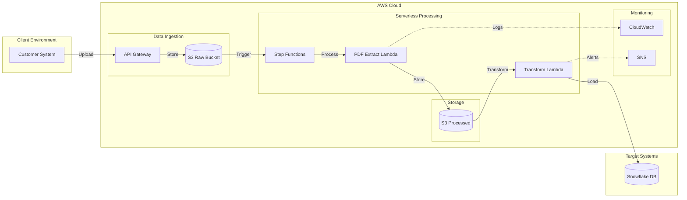
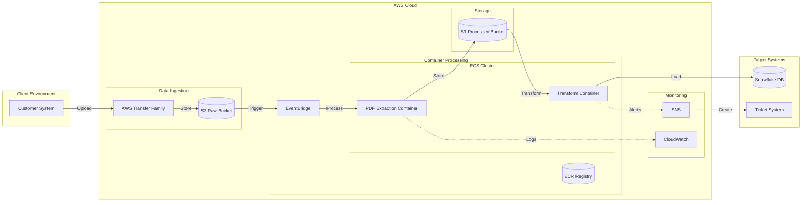

# Architecture Decision Record: PDF Invoice Processing System

## ADR-001: Selection of AWS-Based Processing Architecture

### Status
Accepted

### Context
The organization requires an automated system to process PDF invoices and load them into a data warehouse. The system needs to handle secure file transfers, automated data extraction, and reliable data processing.

#### Business Drivers
- Need for automated invoice processing
- Requirement for secure data handling
- Scalability for growing invoice volumes
- Cost-effective solution
- Compliance with data security standards

#### Technical Requirements
- Secure file transfer capabilities
- PDF text extraction and processing
- Data transformation pipeline
- Data warehouse integration
- Error handling and monitoring
- High availability and reliability

### Options Considered

#### Option 1: Serverless Architecture

**Estimated Costs (Monthly)**
- Lambda Functions: $50-100
- API Gateway: $35
- Step Functions: $25
- S3 Storage: $20
- CloudWatch: $30
- Total: $160-210

**Pros**
- Lower operational costs
- Auto-scaling
- Pay-per-use pricing
- Minimal maintenance

**Cons**
- 15-minute execution limit
- Cold start latency
- Complex orchestration
- Limited processing power

#### Option 2: Container-Based Architecture (Selected)

**Estimated Costs (Monthly)**
- AWS Transfer Family: $216
- ECS Cluster: $150
- S3 Storage: $40
- CloudWatch: $50
- Other Services: $76-426
- Total: $532-882

### Decision
We have chosen Option 2: Container-Based Architecture for the following reasons:

1. **Processing Requirements**
   - No time limitations on processing
   - Better resource control
   - Predictable performance
   - Simpler orchestration

2. **Security & Compliance**
   - Managed SFTP service with authentication
   - Network isolation capabilities
   - Audit logging
   - Compliance certifications

3. **Operational Benefits**
   - Familiar container technology
   - Standard CI/CD practices
   - Better debugging capabilities
   - Easier local development

4. **Scalability**
   - Horizontal scaling capabilities
   - Resource optimization
   - Predictable performance

### Consequences

#### Positive
1. Reliable and secure file transfer through AWS Transfer Family
2. Scalable processing using container infrastructure
3. Better resource utilization and control
4. Comprehensive monitoring and error handling
5. Clear separation of concerns
6. Simplified maintenance and updates

#### Negative
1. Higher base cost ($532-882/month vs $160-210/month)
2. Container management overhead
3. More complex deployment process
4. Additional operational responsibilities

### Risk Analysis

| Risk | Impact | Mitigation |
|------|---------|------------|
| Cost escalation | High | Implement auto-scaling policies, S3 lifecycle management |
| Container failures | Medium | Implement health checks, auto-recovery |
| Processing delays | Medium | Monitor performance metrics, optimize container resources |
| Data security | High | Encrypt data at rest and in transit, implement access controls |

### Cost Optimization Strategies
1. Use Savings Plans for ECS
2. Implement S3 lifecycle policies
3. Optimize container resources
4. Monitor and adjust capacity
5. Consider spot instances for non-critical processing

### Success Metrics
1. Processing time per invoice
2. Error rate
3. System availability
4. Cost per invoice processed
5. Data accuracy rate

### Review Period
- Implementation review: 2 weeks after deployment
- Performance review: 1 month after deployment
- Cost review: 3 months after deployment

### References
1. AWS Well-Architected Framework
2. Container Security Best Practices
3. AWS Pricing Calculator
4. ECS Best Practices Guide 