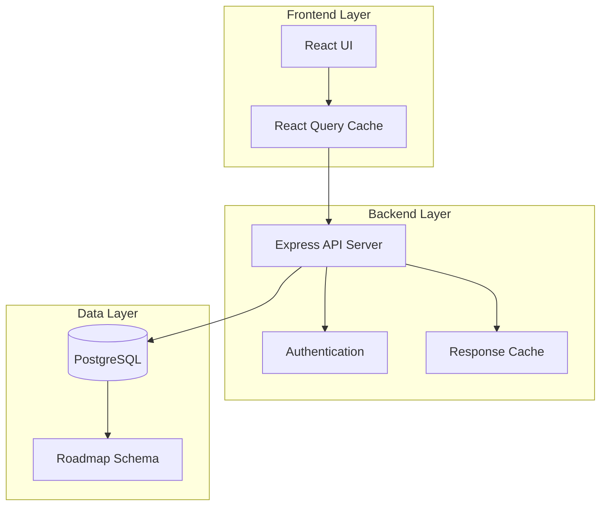
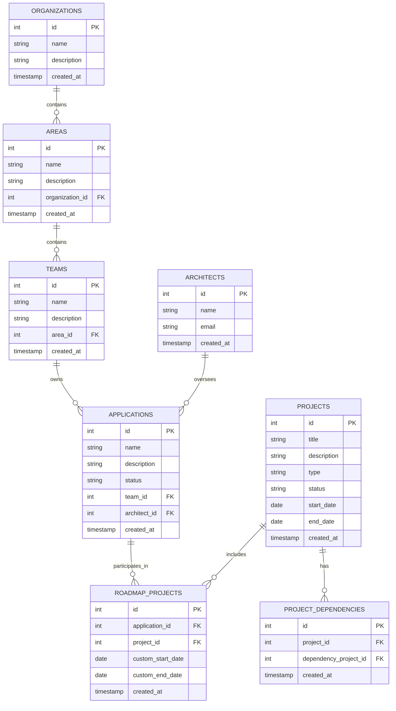
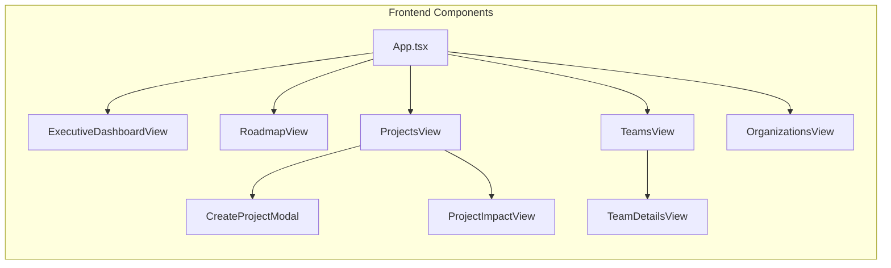
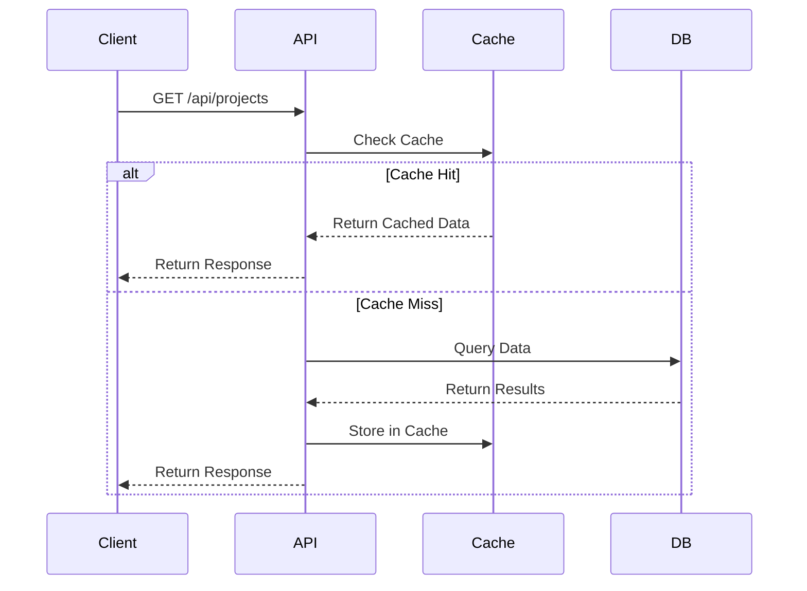
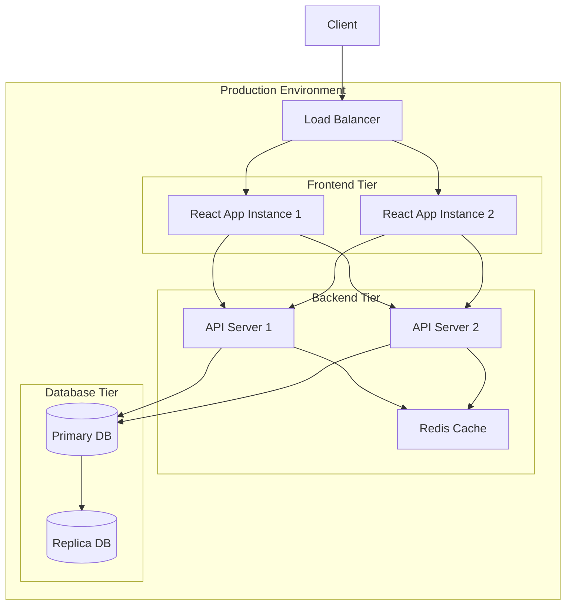
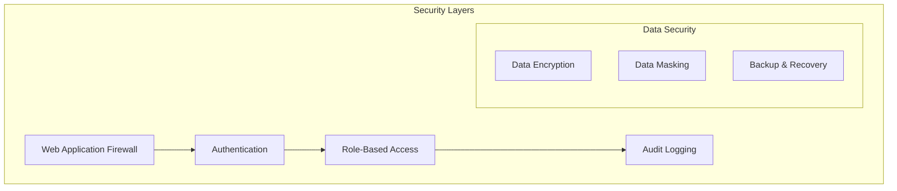
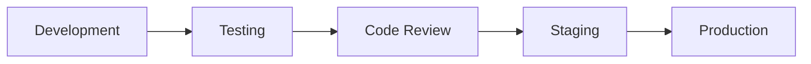
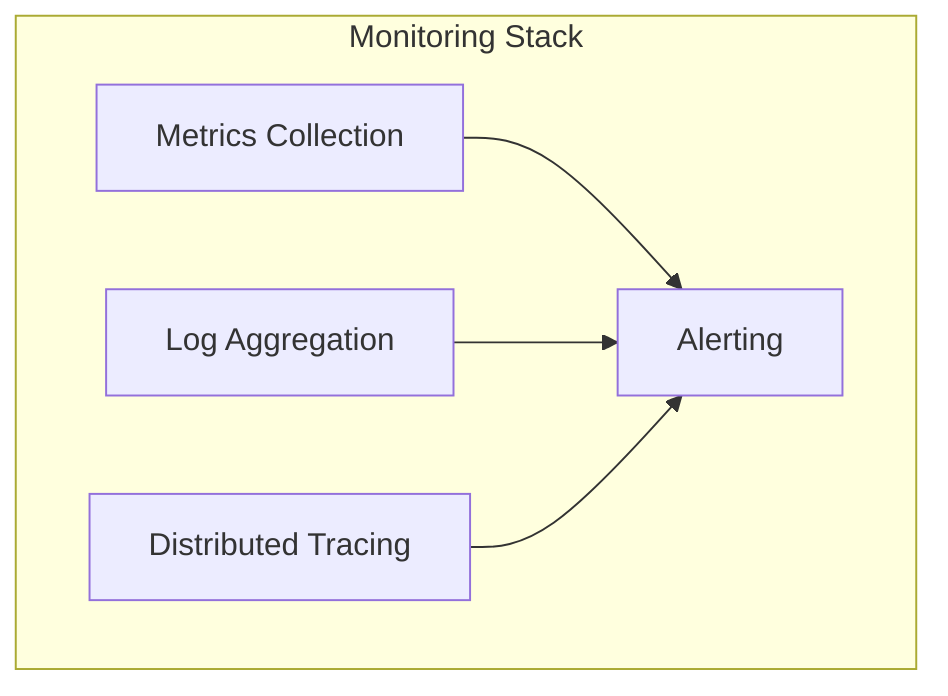

# Enterprise Technology Portfolio - Architecture Documentation

## System Architecture Overview

## Data Model

## Component Architecture

## Network Architecture

## Deployment Architecture

## Security Architecture

## Technical Specifications

### Frontend Technologies
- React 18 with TypeScript
- React Query for state management
- TailwindCSS for styling
- Vite for build tooling
- Jest and React Testing Library for testing

### Backend Technologies
- Node.js with Express
- TypeScript for type safety
- PostgreSQL for data storage
- Redis for caching (planned)
- JWT for authentication

### Infrastructure Requirements
- Node.js runtime environment
- PostgreSQL database server
- Redis server (planned)
- Nginx or similar for reverse proxy
- SSL certificates for HTTPS

### Security Measures
1. **Authentication & Authorization**
   - JWT-based authentication
   - Role-based access control
   - Session management

2. **Data Security**
   - Data encryption at rest
   - Secure communication over HTTPS
   - Input validation and sanitization
   - SQL injection prevention

3. **Infrastructure Security**
   - Regular security updates
   - Firewall configuration
   - Rate limiting
   - CORS policy implementation

### Performance Considerations
1. **Frontend**
   - Code splitting
   - Lazy loading of components
   - Optimized bundle size
   - Client-side caching

2. **Backend**
   - Response caching
   - Query optimization
   - Connection pooling
   - Rate limiting

3. **Database**
   - Indexed queries
   - Optimized schema
   - Regular maintenance
   - Connection pooling

## Development Workflow

## Monitoring and Observability

## Scalability Considerations

1. **Horizontal Scaling**
   - Stateless API design
   - Load balancing
   - Database replication
   - Caching strategy

2. **Vertical Scaling**
   - Resource optimization
   - Performance monitoring
   - Capacity planning

3. **Data Scaling**
   - Partitioning strategy
   - Archival policy
   - Backup strategy

## Future Considerations

1. **Technical Roadmap**
   - Implement Redis caching
   - Add real-time updates
   - Enhance monitoring
   - Implement CI/CD pipeline

2. **Architectural Evolution**
   - Microservices adoption
   - Container orchestration
   - Event-driven architecture
   - GraphQL implementation 